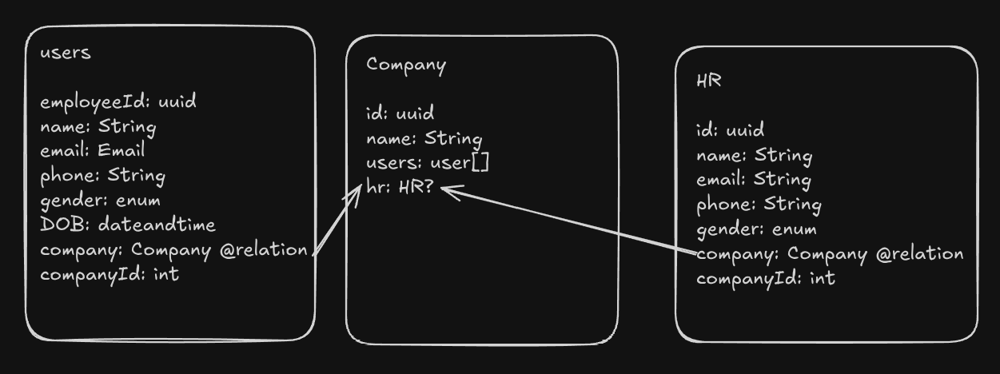

# [Fitplay.life](http://Fitplay.life)

### Overview:

Fitplay.life is an employee wellness rewards platform where employees of partnered companies can redeem wellness-related services and products using a credit-based system (akin to reward points). These offerings are sourced via third-party vendors integrated through APIs. The system must support cash + credit checkout, advanced voucher/redemption logic, order and transaction tracking, role-based dashboards, and analytics for both the Fitplay team and HR stakeholders.

## Backend Architecture:

### Tables Structure:
